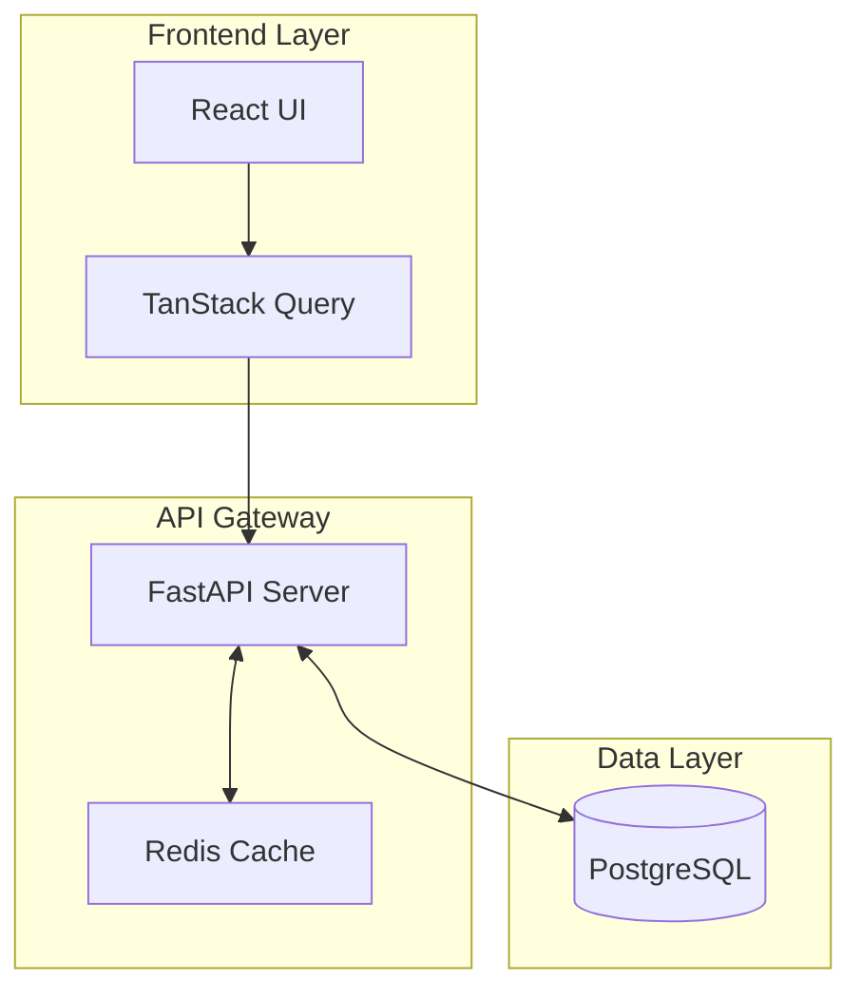
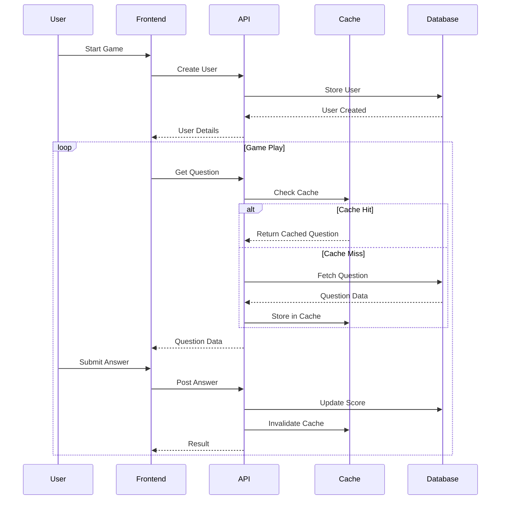
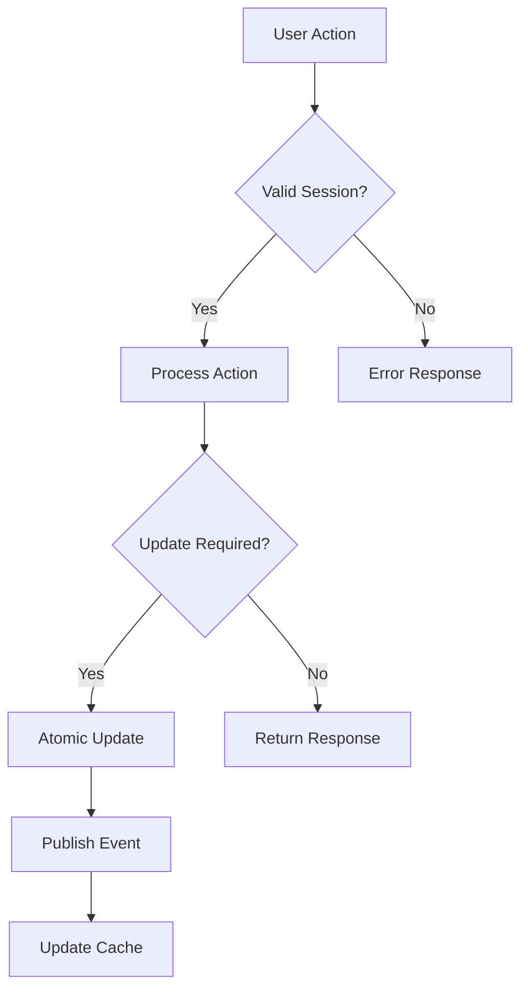
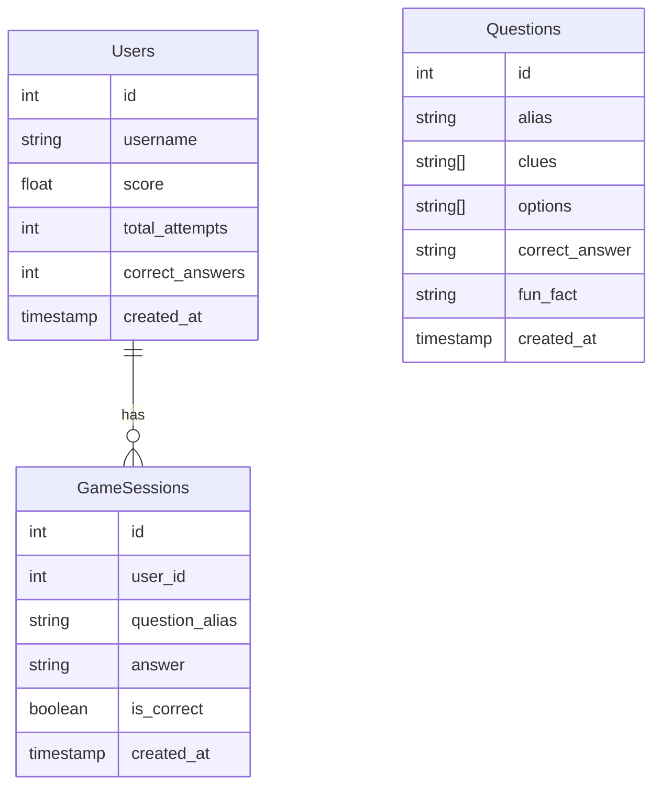
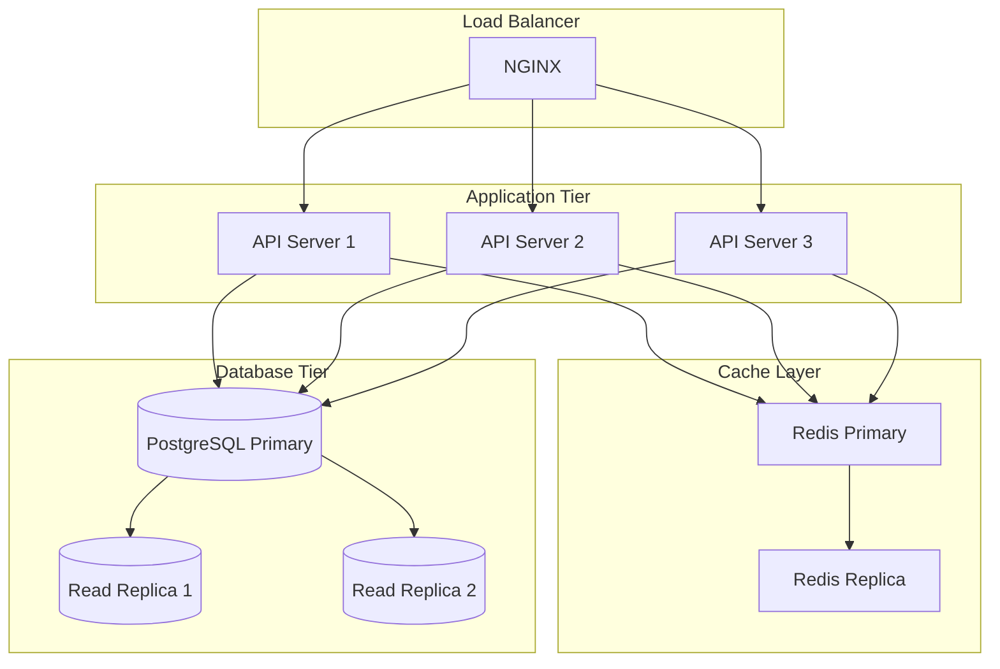

# Globetrotter System Architecture

## System Overview

Globetrotter is a real-time multiplayer geography quiz game built with a modern, scalable architecture. The system uses FastAPI for the backend, PostgreSQL for data persistence, and React with TanStack Query for the frontend.



## Core Components

### 1. Frontend Architecture

- **React with TypeScript**: Type-safe client implementation
- **TanStack Query**: Efficient data fetching and caching
- **Real-time Updates**: Optimistic UI updates with background synchronization
- **State Management**: Distributed state management through React Query

### 2. Backend Architecture

- **FastAPI**: High-performance async API framework
- **PostgreSQL**: Primary data store
- **Redis**: Caching and real-time features
- **Pydantic**: Type validation and serialization

## Data Flow



## Scalability Features

1. **Horizontal Scaling**
   - Stateless API servers can be scaled horizontally
   - Load balancer distributes traffic across API instances
   - Database read replicas for scaling read operations

2. **Caching Strategy**

   ```mermaid
   graph LR
       A[API Request] --> B{Cache?}
       B -->|Yes| C[Return Cached]
       B -->|No| D[Database Query]
       D --> E[Cache Result]
       E --> F[Return Response]
   ```

3. **Performance Optimizations**
   - Question caching with 5-minute stale time
   - Batch database operations
   - Efficient indexing on frequently queried fields
   - Connection pooling for database connections

## Multiplayer Implementation

### Concurrent User Management

- Each user has an independent game session
- Questions are randomly selected from a large pool
- User scores and stats are updated atomically
- Real-time leaderboard updates through Redis pub/sub

### Data Consistency



## Security Measures

1. **Rate Limiting**
   - Per-user request limits
   - IP-based rate limiting
   - Concurrent session limits

2. **Data Validation**
   - Input validation using Pydantic models
   - Request size limits
   - SQL injection prevention through ORM

## Monitoring and Observability

1. **Key Metrics**
   - Request latency
   - Cache hit rates
   - Database connection pool status
   - Active user sessions

2. **Logging**
   - Structured JSON logs
   - Error tracking
   - User activity monitoring

## Database Schema



## API Endpoints

### Game Flow

1. `POST /api/v1/users`
   - Create new user
   - Returns user details and session token

2. `GET /api/v1/game/question`
   - Fetch random question
   - Cached for 5 minutes
   - Different users may get different questions

3. `POST /api/v1/game/answer`
   - Submit answer
   - Updates user score
   - Returns result with fun fact

4. `GET /api/v1/users/{username}/stats`
   - Fetch user statistics
   - Cached with automatic invalidation on score updates

## Deployment Architecture



## Performance Considerations

1. **Database Optimization**
   - Indexed queries
   - Connection pooling
   - Prepared statements
   - Regular vacuum and maintenance

2. **Caching Strategy**
   - Multi-level caching
   - Cache warming
   - Smart invalidation
   - Cache stampede prevention

3. **API Performance**
   - Async operations
   - Batch processing
   - Response compression
   - CDN integration for static assets

## Future Improvements

1. **Real-time Features**
   - WebSocket integration for live updates
   - Multiplayer rooms
   - Live leaderboards
   - Chat functionality

2. **Game Features**
   - Different difficulty levels
   - Category-based questions
   - Time-based scoring
   - Achievement system

3. **Technical Enhancements**
   - GraphQL API
   - Event sourcing
   - Microservices architecture
   - AI-powered question generation
